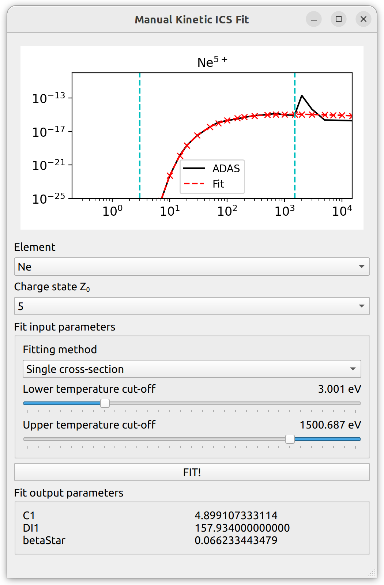

Atomic data
===========
DREAM takes some tabulated atomic data from the ADAS and NIST databases. From
ADAS, we take ionization/recombination/charge-exchange/radiaton rates, while
from NIST we obtain ionization and binding energies. ADAS data is downloaded at
compile time, while NIST data is committed to the GitHub repository. In addition
to using ADAS rates as they are, we also use them to fit the kinetic ionization
cross sections implemented in DREAM.

Since the implementation of new atomic data into DREAM is a somewhat laborious
process (in particular because of the kinetic cross sections), albeit not very
intellectually demanding, we have decided to add new elements only as the need
arises. On this page, we describe the steps required to import a new element
into DREAM. Note that all steps listed below are required for new data to be
added.

.. contents:: Page overview
   :local:
   :depth: 3

1. Selecting ADAS data
----------------------
The first step is to select which ADAS data to use. This is generally done by
looking at the
`Open ADAS documentation for ADF11 <https://open.adas.ac.uk/man/appxa-11.pdf>`_
and noting down the years of the highest quality data available for ACD, CCD,
PLT, PRB and SCD. These should then be added to the JSON file
``tools/elements.json`` which contains the list of elements to import. The data
to import is specified either using the two last digits of the year of the data,
or giving the file name of the data file located under ``tools/cache/``. For
example, the configurations for hydrogen and lithium look like

.. code-block:: json

   "H": {
       "acd": "acd12_h.high_dens.dat",
       "scd": "scd12_h.high_dens.dat",
       "ccd": "96",
       "plt": "plt12_h.high_dens.dat",
       "prb": "prb12_h.high_dens.dat"
   },
   "Li": {
       "acd": "96",
       "scd": "96",
       "ccd": "89",
       "plt": "96",
       "prb": "96"
   }

If the same year is desired for all data files of a particular element, one can
simply give the year, without specifying the data types. This is done for, for
example, helium:

.. code-block:: json

   "He": "96"

.. note::

   If you want to use a custom data file version, please put the file under
   ``tools/cache/`` and specify its file name in the ``elements.json`` file.
   While we normally try to keep ADAS data out of the DREAM repository, such
   special files should be committed to the GitHub repository.

2. Fitting kinetic ICS
----------------------
The ADAS rates assume a plasma in thermodynamic equilibrium. It is however known
that runaway electrons can cause additional excitation of electrons, and so a
kinetic ionization cross section (ICS) has been implemented in DREAM based on
`N A Garland *et al*, Phys Plasmas **27**, 040702 (2020) <https://doi.org/10.1063/5.0003638>`_.
To avoid numerical instabilities which occur in the equilibrium limit, if the
kinetic ICS is not matched to the ADAS data, we adjust the free parameters of
the kinetic ICS so that the ADAS value is recovered in the appropriate limit.

The fitting is mostly automated using a non-linear fitting algorithm from
SciPy, but it is necessary to introduce cut-offs in temperature to ensure that
the fit works well in the temperature region most relevant to tokamak plasmas.
Adjustment must be done manually, but is helped by the GUI program
``tools/ADAS/gui/ManualFit.py`` (requires PyQt5).

After starting the program, select the following:

  1. The element to fit. Note that the element must be listed in ``tools/elements.json``.
  2. The charge state to fit. You will have to fit the charge states one at a time.

The fitting method to use should be *Single cross-section*. Other fitting
functions are provided for testing purposes, but it is the single cross-section
that is used internally in the code.

The fitting procedure then follows in three steps:

  1. Adjust the lower temperature cut-off.
  2. Adjust the upper temperature cut-off.
  3. Click *FIT!* to run the fitting.

The result is displayed at the top of the program. The goal is for the red
crosses to match the black line as perfectly as possible, at least in the
region most relevant to tokamak plasmas (roughly 2 eV to 1 keV). The blue
vertical lines denote the selected temperature cut-offs.

.. note::

   The fit does not have to be perfect everywhere! Sometimes the ADAS data
   even contains suspicious artefacts (as shown above) which we do not want to
   include in the kinetic ICS fit. As long as the fit is good in the
   "intermediate" range, all should be fine.

The selected temperature limits should be added to the file
``tools/kineticCrossSectionParams.json``, which contains a list of upper and
lower temperature cut-offs for each element and charge state. The file uses the
JSON format, and expects the following format:

.. code-block:: json

   "Li": {
       "0": { "Tlow": 0.3, "Tupp": 10005 },
       "1": { "Tlow": 3, "Tupp": 1001 },
       "2": { "Tlow": 3, "Tupp": 1001 }
   }

The field ``Tlow`` is the lower temperature cut-off, while ``Tupp`` is the
upper temperature cut-off. The values specified need not be exact, as the
fitting script will round the specified values to the closest available
temperature in the ADAS data.

3. Run actual kinetic ICS fit
-----------------------------
Once the temperature cut-offs have been gathered, the automatic fitting
procedure can be run. This is done by executing the script
``tools/fit_kineticionization.py`` which will generate a table of fitting
parameter values to be compiled into the code, based on the temperature cut-offs
listed in ``tools/kineticCrossSectionParams.json``. The file containing the
table of parameter values is automatically placed in the right location, and
so no further step is required.

4. Download NIST data
---------------------
NIST data has to be explicitly downloaded by the user by running the script
``tools/get_nist.py``. This scripts reads the contents of
``tools/elements.json`` and downloads either binding or ionization energies for
each species, depending on how the script is run. Because of this, it is
necessary to run the script twice:

.. code-block:: bash

   $ ./get_nist.py
   $ ./get_nist.py --ionization

This should update the files ``src/nistdata_binding.cpp`` and
``src/nistdata_ionization.cpp``.

5. Compile DREAM
----------------
After completing the steps above, everything should be ready and you should only
need to re-compile the code. Simply issuing ``make`` in the build directory
should suffice, assuming you have :ref:`compiled DREAM<compiling>` before.

