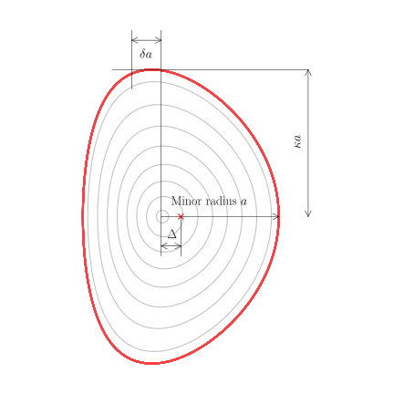

.. _ds-radialgrid:

radialgrid
==========
The radial grid module handles the specification of the spatial grid used in the
DREAM simulation. DREAM currently provides three different types of radial
grids: cylindrical, analytic toroidal, and numeric toroidal.

.. contents:: Page overview
   :local:
   :depth: 3

.. _radgrid-general:

General settings
----------------
While the radial grids described below provide significantly different
geometries, they all share some common settings which must be given.

Radial grid specification
*************************
The location and size of the computational cells in which quantities are
evaluated can be specified in two different ways. Either, the total length of
radial grid can be given, along with the number of cells on that grid (assuming
a uniform cell size), or the location cell boundaries can be given explicitly.

1. Grid size and resolution
^^^^^^^^^^^^^^^^^^^^^^^^^^^
If a uniform radial grid is desired, this grid specification is recommended.
For this grid, the user must specify the total length of the radial grid ``a``
(i.e.  the plasma minor radius), as well as the number of computational cells
``nr`` to divide the plasma into.

.. code-block:: python

   ds = DREAMSettings()
   ...
   ds.radialgrid.setMinorRadius(0.5)
   ds.radialgrid.setNr(100)

(It is also possible to specify the value of the innermost radius used, ``r0``,
although this is not recommended).

2. Arbitrary grid
^^^^^^^^^^^^^^^^^
If a non-uniform radial grid is desired, the boundaries of the computational
cells can be specified. Note that it is the *boundaries* that are to be
specified, in contrast to the cell centres implicitly specified above. From the
specified vector, the three parameters specified above can be derived:

- Innermost cell boundary ``r0``: taken as the first element of the given vector.
- Plasma minor radius ``a``: taken as the last element of the given vector.
- Number of grid cells ``nr``: taken as the length of the specified vector, minus one.

Below we give an example of how a non-uniform radial grid could be specified.
Note that only the call to
:py:meth:`DREAM.Settings.RadialGrid.RadialGrid.setCustomGridPoints` is strictly
necessary.

.. code-block:: python

   import numpy as np

   ds = DREAMSettings()
   ...
   # Plasma minor radius
   a   = 0.5
   # Level of grid non-uniformity
   q   = 2
   # Number of radial grid cells
   nr  = 100

   r_f  = np.linspace(0, a**q, nr+1)**(1/q)
   r_f *= a/r_f[-1]   # correct for roundoff

   ds.radialgrid.setCustomGridPoints(r_f)

Tokamak wall radius
*******************
The location of the tokamak wall relative to the magnetic axis is given using
the parameter ``b``. This parameter influences the boundary condition used when
solving for the :ref:`electric field<ds-eqsys-E_field>`.

.. code-block:: python

   ds = DREAMSettings()
   ...
   ds.radialgrid.setWallRadius(wall_radius=0.65)

Cylindrical grid
----------------
The cylindrical radial grid mode asumes cylindrical geometry in the simulation.
This is mathematically equivalent to taking the :math:`R_0/a\to\infty` limit in
toroidal geometry, where :math:`R_0` is the tokamak major radius and :math:`a`
the plasma minor radius.

The cylindrical grid mode only requires the specification of one additional
parameter to the parameters of the radial grid described above in
:ref:`radgrid-general`. The required parameter is the magnetic field strength
``B0``, which must be given in SI units (Tesla).

.. note::

   Due to the cylindrical geometry, the magnetic field strength specified is the
   magnetic field *everywhere*. If you would like to simulate a specific tokamak
   in this mode, however, you should set ``B0`` to the toroidal magnetic field
   strength on the magnetic axis. The infinite-aspect ratio assumption made in
   cylindrical geometry means that model is only valid sufficiently close to the
   magnetic axis of a tokamak.

.. code-block:: python

   ds = DREAMSettings()
   ...
   ds.radialgrid.setMinorRadius(0.5)    # Plasma minor radius
   ds.radialgrid.setWallRadius(0.65)    # Tokamak wall minor radius
   ds.radialgrid.setNr(100)             # Number of grid cells
   ds.radialgrid.setB0(3.2)             # Magnetic field strength

.. _radgrid-analytic:

Analytic toroidal grid
----------------------

DREAM implements an analytic five-parameter toroidal magnetic field. The model
includes the three shaping parameters illustrated in the figure below, namely
elongation :math:`\kappa(r)`, triangularity :math:`\delta(r)` and Shafranov
shift :math:`\Delta(r)`, which together determine the location and shape of
the flux surfaces. In addition to the shaping parameters, the analytic magnetic
field also needs information about the toroidal magnetic field function
:math:`G(r) = RB_\varphi` and the poloidal flux function :math:`\psi_{\rm p}`.

   Definition of the three shaping parameters in the analytic toroidal magnetic
   field model in DREAM. The three parameters are :math:`\kappa(r)`
   (elongation), :math:`\delta(r)` (triangularity), and :math:`\Delta(r)`
   (Shafranov shift). The elongation is the scale factor determining the length
   of the major axis of the ellipse; the triangularity determines horizontal
   shift of the top-most point of the flux surface; the Shafranov shift is the
   shift from the magnetic axis of the center of a flux surface.

Flux surfaces are parametrized in this model as

.. math::

   \boldsymbol{x} &= R\hat{R} + z\hat{z},\\
   R &= R_0 + \Delta(r) + r\cos\left[\theta + \delta(r)\sin\theta\right],\\
   z &= r\kappa(r)\sin\theta,\\
   \hat{R} &= \cos\varphi\hat{x} + \sin\varphi\hat{y}

where :math:`R_0` is the tokamak major radius, :math:`r` is the minor radius
coordinate, :math:`\theta` is the poloidal angle, and :math:`\varphi` is the
toroidal angle.

The parameters that can be specified to the analytic magnetic field are:

+--------------------------+-------------------+-----------------------------------+
| Parameter                | Name in interface | Description                       |
+==========================+===================+===================================+
| :math:`\Delta(r)`        | ``Delta``         | Shafranov shift.                  |
+--------------------------+-------------------+-----------------------------------+
| :math:`\delta(r)`        | ``delta``         | Triangularity.                    |
+--------------------------+-------------------+-----------------------------------+
| :math:`G(r)/R_0`         | ``GOverR0``       | Toroidal magnetic field function. |
+--------------------------+-------------------+-----------------------------------+
| :math:`\kappa(r)`        | ``kappa``         | Elongation.                       |
+--------------------------+-------------------+-----------------------------------+
| :math:`\psi_{\rm p}/R_0` | ``psi``           | Poloidal flux function.           |
+--------------------------+-------------------+-----------------------------------+

Example
*******
The following illustrates how an analytic toroidal magnetic field could be
specified in DREAM:

.. code-block:: python

   import DREAM.Settings.RadialGrid as RGrid
   import numpy as np

   ds = DREAMSettings()
   ...
   # Basic tokamak parameters
   a  = 0.22
   R0 = 0.68
   B0 = 5.0

   # Set up input radial grids
   rDelta = np.linspace(0, a, 20)
   rdelta = np.linspace(0, a, 20)
   rkappa = np.linspace(0, a, 20)
   rpsi   = np.linspace(0, a, 20)

   # Set shaping parameters
   Delta = np.linspace(0, 0.1*a, rDelta.size)   # Shafranov shift
   delta = np.linspace(0, 0.2, rdelta.size)     # Triangularity
   kappa = np.linspace(0, 1.5, rkappa.size)     # Elongation

   # Toroidal field function
   GOverR0 = B0       # = R*Bphi/R0

   # Poloidal flux
   mu0 = 4e-7 * np.pi       # Permeability of free space
   IpRef = 200e3            # Reference plasma current which generates poloidal field
   psi = -mu0 * IpRef * (1-(rpsi/a)**2) * a

   ds.radialgrid.setShaping(psi=psi, rpsi=rpsi, GOverR0=GOverR0, kappa=kappa,
       rkappa=rkappa, Delta=Delta, rDelta=rDelta, delta=delta, rdelta=rdelta)
   ds.radialgrid.setWallRadius(a*1.1)
   ds.radialgrid.setMajorRadius(R0)

   # Numerics parameters
   ds.radialgrid.setMinorRadius(a)
   ds.radialgrid.setNr(100)

.. note::

   While this example gives all shape parameters explicitly, and most of them
   as functions of radius, it is only required to specify the toroidal field
   function :math:`G(r)` and the poloidal flux function :math:`\psi_{\rm p}(r)`.
   Also, parameters can also be given as constants, in which case the
   corresponding radial grid parameter is not necessary and the parameter is
   assumed to take the prescribed value at all radii.

Numeric toroidal grid
---------------------
DREAM allows numerical magnetic fields obtained from, for example,
Grad-Shafranov solvers such as EFIT or LIUQE, to be used to specify the
geometry in simulations. Numerically specified magnetic fields are not subject
to the symmetry constraints of the :ref:`radgrid-analytic`, but still relies on
the assumption that each flux surface has exactly one minimum and one maximum
in the magnetic field strength.

Internally, DREAM uses information about the magnetic field and geometry of a
number of flux surfaces. The information is represented internally by the
following parameters:

- :math:`R_0, Z_0`: major radius and vertical position of magnetic axis.
- :math:`\psi_{\rm p}, \theta`: Poloidal flux and poloidal angle coordinates for flux surfaces.
- :math:`R(\psi_{\rm p},\theta), Z(\psi_{\rm p},\theta)`: mapping of flux surfaces from poloidal flux/angle to cylindrical coordinates.
- :math:`B_\varphi(\psi_{\rm p},\theta), B_r(\psi_{\rm p},\theta), B_z(\psi_{\rm p},\theta)`: Magnetic field components.

From this information, DREAM derives and calculates the various bounce and flux
surface averages used for a simulation. Note however that this data is only used
internally, and can (in principle) be loaded from files of various formats.

File formats
************
Magnetic field data can be stored in a number of different ways. DREAM supports
the following file formats for magnetic fields:

LUKE
^^^^
LUKE is a bounce-averaged Fokker--Planck solver developed by Y. Peysson and
J. Decker, and written in Matlab. While there is no official standard for the
magnetic equilibrium files used by LUKE, a de facto standard has evolved which
is used in most cases.

.. note::

   LUKE magnetic equilibrium data is usually stored in a Matlab ``.mat`` file.
   For DREAM to be able to read the file, it must be stored as a version 7.3
   Matlab file. DREAM can also read regular HDF5 files.

A LUKE magnetic equilibrium file contains a structure named ``equil`` which
in turn contains the actual data for the equilibrium. The following fields
should be present in the file:

+--------------+----------------------------+-----------------------------------------------------------------------------------------------------------------------------------------+
| Field        | Shape                      | Description                                                                                                                             |
+==============+============================+=========================================================================================================================================+
| ``id``       | N/A                        | String describing the equilibrium data.                                                                                                 |
+--------------+----------------------------+-----------------------------------------------------------------------------------------------------------------------------------------+
| ``Rp``       | (1,)                       | Major radius coordinate of magnetic axis, :math:`R_{\rm p} = R_0`.                                                                      |
+--------------+----------------------------+-----------------------------------------------------------------------------------------------------------------------------------------+
| ``Zp``       | (1,)                       | Vertical position of magnetic axis, :math:`Z_{\rm p} = Z_0`.                                                                            |
+--------------+----------------------------+-----------------------------------------------------------------------------------------------------------------------------------------+
| ``psi_apRp`` | (:math:`n_\psi`,)          | Poloidal flux grid; normalized by the aspect ratio, i.e. :math:`\texttt{psi_apRp} = \psi_{\rm p} / (R_0/a)`.                            |
+--------------+----------------------------+-----------------------------------------------------------------------------------------------------------------------------------------+
| ``theta``    | (:math:`n_\theta`,)        | Poloidal angle grid; defined as :math:`\texttt{theta} = \mathrm{arctan2}(Z-Z_0, R-R_0) = \mathrm{arctan2}(\texttt{pty}, \texttt{ptx})`. |
+--------------+----------------------------+-----------------------------------------------------------------------------------------------------------------------------------------+
| ``ptx``      | (:math:`n_\theta, n_\psi`) | Mapping from :math:`(\psi_{\rm p}, \theta)` to the radial coordinate :math:`R-R_0`.                                                     |
+--------------+----------------------------+-----------------------------------------------------------------------------------------------------------------------------------------+
| ``pty``      | (:math:`n_\theta, n_\psi`) | Mapping from :math:`(\psi_{\rm p}, \theta)` to the vertical coordinate :math:`Z-Z_0`.                                                   |
+--------------+----------------------------+-----------------------------------------------------------------------------------------------------------------------------------------+
| ``ptBx``     | (:math:`n_\theta, n_\psi`) | Radial component of the magnetic field, :math:`B_r(\psi_{\rm p}, \theta)`.                                                              |
+--------------+----------------------------+-----------------------------------------------------------------------------------------------------------------------------------------+
| ``ptBy``     | (:math:`n_\theta, n_\psi`) | Vertical component of the magnetic field, :math:`B_z(\psi_{\rm p}, \theta)`.                                                            |
+--------------+----------------------------+-----------------------------------------------------------------------------------------------------------------------------------------+
| ``ptBPHI``   | (:math:`n_\theta, n_\psi`) | Toroidal component of the magnetic field, :math:`B_\varphi(\psi_{\rm p}, \theta)`.                                                      |
+--------------+----------------------------+-----------------------------------------------------------------------------------------------------------------------------------------+

.. note::

   LUKE magnetic equilibrium data files can also contain a cell array of
   ``equil`` structs, corresponding to equilibria at different times. DREAM
   does not currently support time evolving magnetic fields and will not be able
   to read such files at all.

.. _radgrid-assumptions:

Assumptions for toroidal magnetic fields
----------------------------------------
- One maximum, one minimum, per flux surface (no negative triangularity)

Magnetic ripple
---------------

Class documentation
-------------------

.. autoclass:: DREAM.Settings.RadialGrid.RadialGrid
   :members:
   :undoc-members:
   :show-inheritance:
   :special-members: __init__
